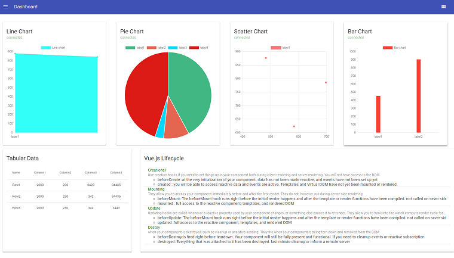
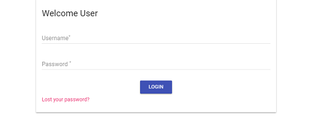
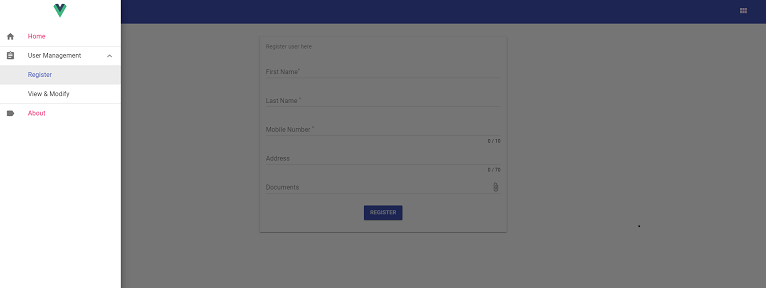

# Dashboard(Vue.js 2)
 > This Materialised dashboard is build using vue 2 ui framework. 
## Features
  - Realtime charting (Websocket enabled)
  - CRUD operations using Store
  - Jwt authorization 
  - File upload 
  - Vue.js Lifecycle 
## Todo
  - Role based user		
  - Change header on route change
  - Internationalisation support
  
####Screen Shots 







## Build Setup

``` bash
# install dependencies
npm install

# serve with hot reload at localhost:8080
npm run dev

# build for production with minification
npm run build

# build for production and view the bundle analyzer report
npm run build --report

# run unit tests
npm run unit

# run e2e tests
npm run e2e

# run all tests
npm test
```
For detailed explanation on how things work, checkout the [guide](http://vuejs-templates.github.io/webpack/) and [docs for vue-loader](http://vuejs.github.io/vue-loader).

####Third party libraries used
- vue-material 
- vue-chartjs
- axios


